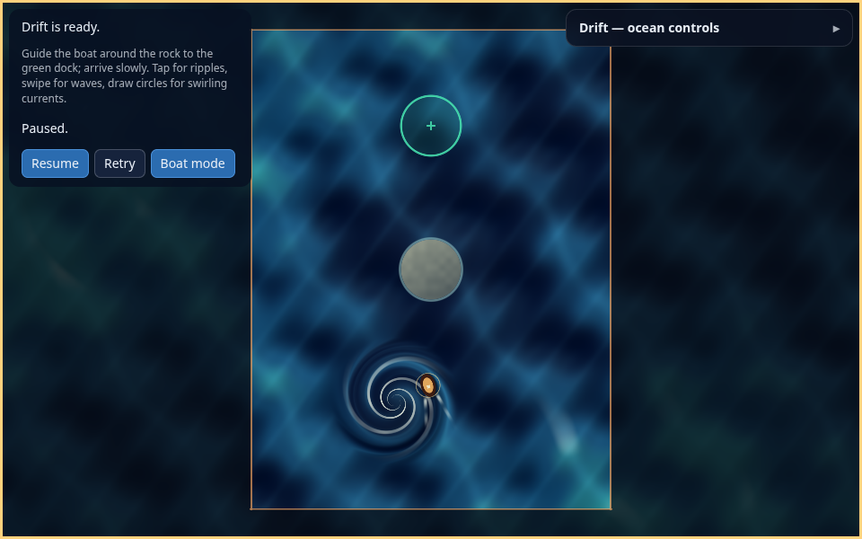

# Ludus-Sandbox — Drift ripple boat

External sandbox application for developing and validating the Ludus engine SDK.

This checkout contains **Drift**, a top-down 2D water playground with a first
playable boat/water slice. Tap for an expanding ripple, swipe for a traveling
wave, or draw circles for a swirling current. Waves and swirls transport the
disabled boat in the direction of the gesture; ripples push it away on contact.
Guide the boat around the rock and arrive slowly in the green dock. Pause,
Retry after a crash, or switch to the existing ocean tuning mode.

Rendering uses one procedural fullscreen pass authored in Slang, compiled to
SPIR-V for native Vulkan, WGSL for WebGPU, and generated GLSL ES for WebGL 2.
Game rules and state live in this repository and consume the installed Ludus SDK.



The browser build is the playable target. Native compilation is verified, but
native pointer controls have not been connected. One rescue course includes
rocks, docking and crash/Retry; three-level progression remains the next milestone.

## Highlights

* **Engine via SDK only.** Consumes Ludus through `find_package(Ludus CONFIG
  REQUIRED)` and links public targets (`Ludus::GraphicsRhi`, `Ludus::Platform`,
  …). No engine sources are vendored and no private/backend headers are used.
* **One procedural pass.** `shaders/ocean.slang` is the only shader; it is built
  at configure/build time by the engine's `ludus_compile_shader` helper into
  SPIR-V + WGSL + GLSL ES. No shader compiler or network request runs during gameplay.
* **Scene/tuning state lives outside GPU code.** `src/ocean/` is a pure,
  dependency-light C++ layer (settings, validation, JSON, coordinate mapping,
  current/time integration) that is unit-tested without a GPU or an SDK.
* **Browser fallback.** Auto tries WebGPU, then WebGL 2 on a fresh canvas.
  Force either path with `?backend=webgpu` or `?backend=webgl2`. Restart remains
  available when both fail; controls stay clear of the status message.
* **Accessible controls.** The browser build wraps the canvas in a collapsible
  DOM panel (`web/shell.html`) that talks to the app through a tiny explicit
  bridge; the engine stays unaware of ocean controls.

## Documentation

| Doc | Contents |
| --- | --- |
| [docs/BUILD.md](docs/BUILD.md) | Exact, reproducible build / run / package commands (native + web), required engine revision and SDK variant. |
| [docs/DESIGN.md](docs/DESIGN.md) | World units, coordinate orientation, aspect-correct mapping, current/time continuity, architecture, and the uniform contract. |
| [Ripple game design](docs/RIPPLE_GAME_DESIGN.md) | Boat, ripple steering, hazards, docking, touch controls, and first levels. |
| [Ripple game architecture](docs/RIPPLE_GAME_ARCHITECTURE.md) | Simulation timing, input, collision, shader snapshot, and engine/host boundaries. |
| [Ripple game milestones](docs/RIPPLE_GAME_MILESTONES.md) | Acceptance gates from the existing ocean to a packaged browser game. |
| [First playable implementation](docs/RIPPLE_GAME_IMPLEMENTATION.md) | Implemented controls, tuning, exact validation and remaining acceptance. |
| [Rescue course](docs/RIPPLE_GAME_M2.md) | Rock hazards, slow docking, crash/Retry, and level validation. |
| [Ocean interactions](docs/OCEAN_INTERACTIONS.md) | Swipe waves, signed swirls, water lighting, gesture lifecycle and validation. |
| [docs/VALIDATION.md](docs/VALIDATION.md) | Honest validation results: what was verified here, what requires a GPU host, and how to reproduce the remaining checks. |

CI (`.github/workflows/ci.yml`) defines three gates on every push/PR:
a fast format + clang-tidy + GPU-free-tests gate, a native SDK build + `ctest`
(with real `spirv-val`), and an exact Release ZIP browser test on real software WebGPU/WebGL 2, with
the tested artifact and evidence uploaded. Current CI status belongs to the PR. See
[docs/VALIDATION.md](docs/VALIDATION.md#continuous-integration) for details.

## Quick start

```bash
# 1. Acquire Ludus + pinned shader tools and configure native + browser builds.
#    Pins the engine revision in config/ludus-version.txt and wires the
#    pinned Slang/SPIRV-Tools into CMake. See docs/BUILD.md for details and
#    for pointing at an already-installed SDK (--sdk-dir / LUDUS_SANDBOX_SDK_DIR).
./init.sh --with-web

# 2a. Native (Vulkan) — requires a Wayland display and a Vulkan-capable GPU.
cmake --build --preset linux-clang-development
./out/build/linux-clang-development/LudusSandbox            # Drifting preset
./out/build/linux-clang-development/LudusSandbox choppy     # or a preset name
LUDUS_OCEAN_SETTINGS=my-ocean.json \
  ./out/build/linux-clang-development/LudusSandbox          # or a settings file

# 2b. Browser — Auto selects WebGPU or falls back to WebGL 2.
cmake --build --preset web-emscripten-development
python3 -m http.server 8000 --bind 127.0.0.1 \
  --directory out/build/web-emscripten-development
#   then open http://127.0.0.1:8000/

# 3. GPU-free logic tests (no SDK/GPU required).
ctest --test-dir out/build/linux-clang-development --output-on-failure
```

## Repository layout

```
shaders/ocean.slang        Author-owned ocean (SPIR-V + WGSL + GLSL ES)
src/game/                  Fixed-tick boat/ripple physics and render snapshots
src/ocean/                 GPU-free scene & tuning (settings, clock, uniforms, mapping)
src/ocean/ocean_scene.*    RHI lifecycle driver (public API only)
src/main_native.cpp        Native entry (config/CLI settings)
src/main_web.cpp           Web entry + DOM bridge
web/shell.html             Accessible collapsible tuning panel
tests/ocean_tests.cpp      Ocean validation, mapping and continuity tests
tests/ripple_tests.cpp     Ring contact, steering, timing and snapshot tests
tools/preview/             Offline CPU renderer for screenshots (not shipped in the game)
docs/                      Build, design, validation docs + screenshots
```
