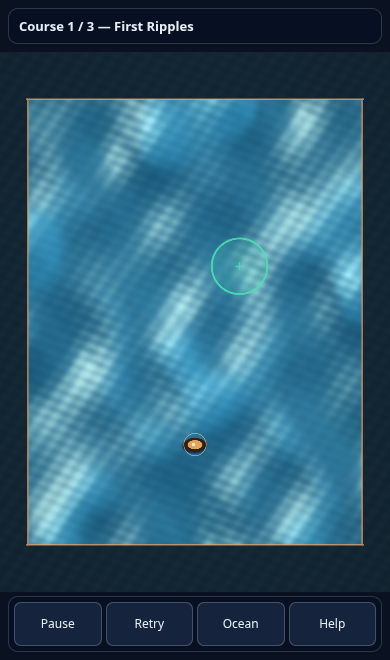
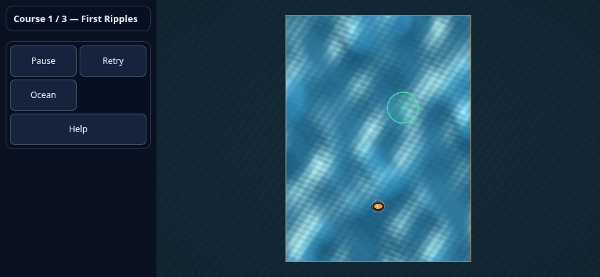

# Mobile ocean HUD

Portrait phones and short embeds reserve a compact course strip above the
canvas and a 44 px button row below it. Landscape screens use a left sidebar
so the ocean keeps its full height. Safe-area insets apply to the canvas and
controls. The camera and pointer bridge use the resulting canvas rectangle.

The persistent instruction card is now a Help dialog. Opening Help cancels the
current stroke and pauses the simulation. Closing it with the button or Escape
restores the previous pause choice and returns focus to the canvas. Crash,
rescue and docking feedback appears when relevant; ordinary play has no
feedback card over the water. Ocean tuning remains an optional scrollable panel.

These screenshots show the packaged Release game in Chromium with SwiftShader
at 390 × 660 and 844 × 390 CSS pixels. They are emulated phone layouts, not
physical iPhone or Safari validation. The ambient sea is frozen through the
existing focus-loss path for capture; no rendering or simulation was changed.

The [browser HUD checks](../tools/browser-tests/README.md#mobile-hud) cover both
WebGPU and WebGL 2 at those sizes, 320 × 568, and a 320 × 360 embed. They verify
that persistent controls do not overlap the canvas, buttons remain at least
44 × 44 px, safe areas and tuning stay bounded, real touch maps onto the inset
canvas, Help preserves pause and focus, and graphics restart preserves layout.
CI saves the screenshots and report alongside the existing gameplay evidence.
