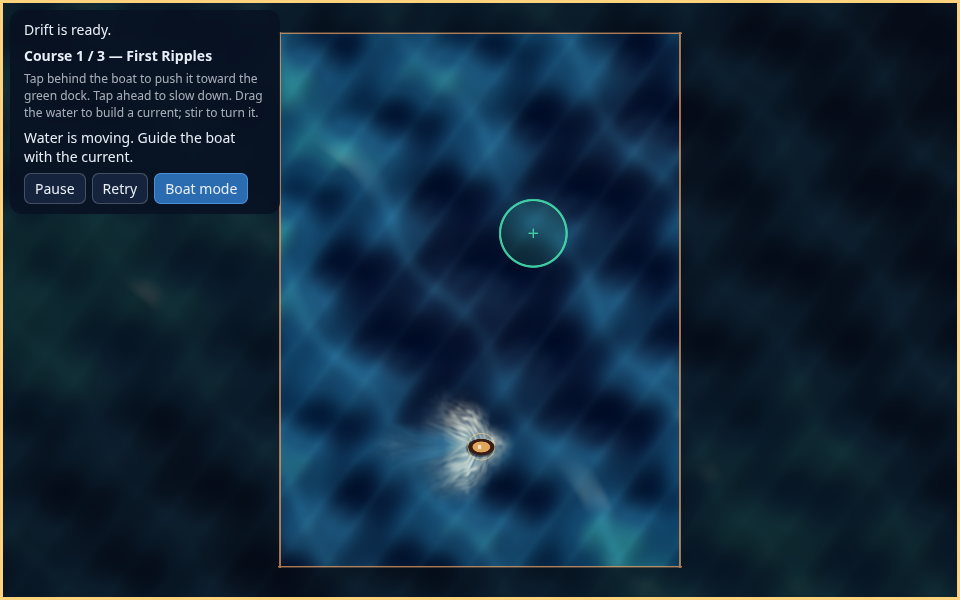
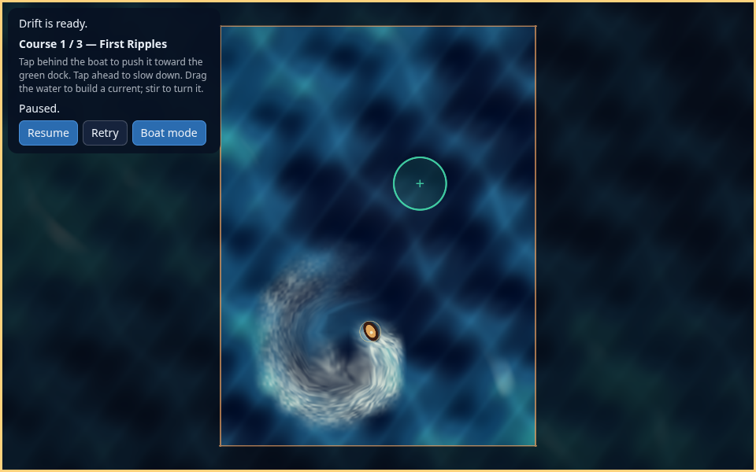

# Ocean flow field

Dragging adds momentum to a shared velocity field. Surface height responds to
its divergence, and the height gradient accelerates the water back. A curved
stroke deposits tangential momentum along its actual path, so circulation
emerges without classifying a circle, fitting a center or spawning a vortex.
Strokes combine with the water already there; opposite strokes can cancel it.
Boat drag samples this same field.




## Simulation

`WaterField` owns a 48 × 64 staggered grid: horizontal/vertical velocities on
cell faces and height, foam and material displacement at cell centers. It uses
one roughly 300 KB allocation, reports allocation failure through `Ready()` and
rejects forcing when unavailable. There are no allocations during gestures,
stepping, sampling or reset. Copying is disabled; course transitions reuse the
field storage, avoiding large temporaries on the 64 KB browser stack.

Each segment integrates a compact 4 m momentum brush with at most 0.4 m spacing
and distance-weighted force. The force does not depend on the number of pointer
events. Sampling only faces in the brush support bounds the work. The existing
0.4 m jitter filter and 2.5 m tap threshold remain. There is no effect pool,
shape recognition, authored spiral or per-stroke expiration timer.

At 60 Hz, substeps perform:

1. Semi-Lagrangian self-advection of face velocities with midpoint backtracing.
2. Gravity acceleration `du/dt = -g gradient(h)` and velocity damping.
3. Height update `dh/dt = -H divergence(u)` using paired face fluxes.
4. Transport of material displacement and foam, with foam production from
   compression and gradual dissipation.

`g = 9.8`, `H = 2`, and the substep bound uses wave speed `sqrt(g H)`, a 10 m/s
component speed cap and minimum cell spacing. This is a game-oriented,
linearized free-surface model with advected momentum, rather than full nonlinear
shallow-water or deep-ocean simulation. Height is bounded to ±3 m for extreme
forcing, so clipping can change integrated height in those extreme cases.
Ordinary unsaturated closed-domain waves conserve integrated height. The
material map relaxes slowly and is bounded to ±12 m. Semi-Lagrangian numerical
diffusion and damping dissipate circulation without a hard expiry.

The formulation follows the height/divergence and pressure coupling described
in [Robert Bridson's shallow-water lecture](https://www.cs.ubc.ca/~rbridson/courses/533d-fall-2005/nov17-cs533d-slides.pdf).
Grid self-advection and material transport use the Eulerian approach discussed
in [GPU Gems chapter 38](https://developer.nvidia.com/gpugems/gpugems/part-vi-beyond-triangles/chapter-38-fast-fluid-dynamics-simulation-gpu).
Unlike an incompressible projection, the free-surface update keeps divergence
available to generate waves.

Rock cells and the rectangular water boundary close normal velocity faces.
Height waves reflect from them; backtracing rejects solid-crossing samples.
Input rejects rock crossings even when a fast stroke has only down/up events.
Rock geometry is rasterized at simulation resolution. Pause and terminal states
freeze the field. The terminal tick advances it only to the boat's collision
time. Cancel stops further forcing while existing water keeps moving; reset
clears the field, and graphics restart preserves it.

The three-course rescue game and its tap ripple steering remain intact. Taps
retain their existing analytic radial impulse and rendering. Ambient wind
swells and boat wakes also remain cosmetic. The new field replaces the scripted
swipe-wave and vortex effects specifically.

## Rendering contract

The installed renderer has no public texture/compute API. The application
samples the field into a 16 × 24 grid in its uniform block, leaving engine APIs
and the pinned SDK unchanged. Each sample contains velocity.xy, height, foam
and material displacement.xy. Two floats store six eight-bit channels as
exactly representable 24-bit integers. Zero signed channels use byte 128;
velocity, height and displacement ranges are ±10, ±3 and ±12 respectively.
The shader decodes before bilinear interpolation. An undisturbed field uses a
zero velocity range as an idle marker, skipping all grid lookups per pixel.

The 3840-byte std140 block keeps the existing fields through offset 735. Boat
motion starts at 736, field metadata at 752 and 192 vec4 samples at 768. C++
assertions, SPIR-V/WGSL/GLSL ES reflection and the packager enforce that layout.
Quantization and the coarser render grid smooth fine details; the boat samples
the full simulation grid. Normals and coloration use sampled height. The
water pattern and foam breakup use the advected material map; foam comes from
the transported solver state, with contrast remapped for visibility. There is
no gesture-shaped rendering overlay for swipes or swirls.

## Validation

Use the selectable presets generated by setup and SDK revision
`9554d051b2125580327d9f89c06395798a53028d` from `config/ludus-version.txt`.
Machine paths remain in ignored local presets.

```bash
cmake --build --preset linux-clang-development
ctest --preset linux-clang-development --output-on-failure
cmake --build --preset web-emscripten-release
./scripts/package-web
python3 -m zipfile -e out/packages/drift-ocean-web-release.zip out/browser-qa/extracted
node tools/browser-tests/run.mjs out/browser-qa/extracted out/packages/drift-ocean-web-release.zip out/browser-qa/renderers
node tools/browser-tests/ripple.mjs out/browser-qa/extracted out/browser-qa/courses
node tools/browser-tests/gestures.mjs out/browser-qa/extracted out/browser-qa/gestures
```

The logic tests cover circulation sign and persistence, divergence creating
height, propagation beyond the brush, material advection, boat transport,
cancellation of opposite strokes, dense/sparse event equivalence, integrated
height conservation, solid boundaries, small-domain stability, invalid input,
terminal clipping and campaign reset. Browser checks use actual mouse/emulated
touch strokes, read-only field diagnostics, signed circulation and material
transport after release, screenshots, exact pause freezing and graphics restart.
The DOM exposes field energy, peak curl/divergence and height as QA data, without
adding technical controls to gameplay.

Local results and the exact tested package hash are in
[OCEAN_FLOW_VALIDATION.json](OCEAN_FLOW_VALIDATION.json). Browser tests use pinned
Chromium 140.0.7339.186 with SwiftShader and test-only RAF delays. They establish
software-rendered behavior, not physical mobile input, hardware frame timing or
hosted itch.io publication.
