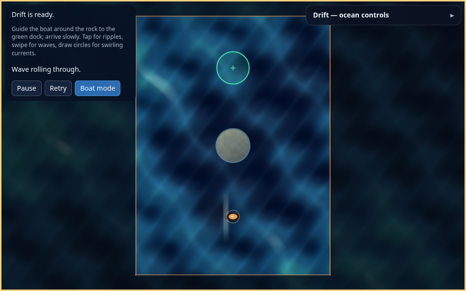

# Ocean interaction update

The water now responds to the shape of a gesture. Taps produce radial ripples,
straight swipes produce traveling wave crests, and circular strokes produce
clockwise or counterclockwise currents. The wave/current records also supply
the boat's local water velocity, so visible motion and steering agree.




## Interaction and simulation

One primary pointer owns a captured stroke. Positions are mapped from the
current canvas CSS rectangle to the fitted world camera; DPR does not change
gesture geometry. A tap commits on release. Movement shorter than 0.4 m is
ignored as jitter, and a path shorter than 2.5 m remains a tap.

A drag creates one bounded surface effect. Turning more than 1.5 radians with
at least six samples and a consistent rotation converts that effect to a vortex
instead of emitting extra rings. Three spaced samples estimate its center;
nearly collinear or out-of-water circle fits are rejected. Alternating zigzags
do not count as circular motion. History holds at most 64 samples and the pool
holds eight effects; neither allocates per event or frame.

| Effect | Behavior |
| --- | --- |
| Tap ripple | Existing 20 m/s expanding ring; one swept contact impulse per hull, 1.5 s lifetime and 0.25 s tap cooldown |
| Swipe wave | Crest travels at 12 m/s in the stroke direction; compact 2 m half-width pulse transports the hull through water drag; 3 s lifetime |
| Circular current | Tangential velocity has the gesture's signed rotation and a smooth bounded radial footprint; stirring replenishes energy without restarting phase; fades over 5 s after motion stops |

Strength and width grow with stroke length; vortex strength grows with coherent
turning. Boat drag and speed limits still come from `PhysicsSettings`.
Ambient animation settings remain cosmetic and never become transport velocity.
Strokes reject rock positions and use the loaded level bounds. Crash and
arrival reject further input and freeze effects at the same clipped tick time
as the boat. The surface effects age on the existing 60 Hz simulation ticks. Pause, hidden
state, focus loss and tuning mode freeze the world; reset clears it. Restart
preserves effects and the boat. Cancellation discards an unfinished tap and
stops further stirring; already emitted water motion dissipates naturally.

The DOM tracks pointer identity, cancellation, capture loss, blur, visibility,
resize and canvas replacement. Secondary fingers cannot move or release the
primary stroke. Controls cancel strokes and own their input.

## Appearance and rendering contract

The single Slang shader adds crossing swells, curved crest ridges, shorter wind
ripples, surface-normal lighting and sparse broken whitecaps. Gesture waves
raise and shade a moving crest; vortices deform the sampled water, darken the
center and rotate spiral foam. Tap rings now shade a surface disturbance rather
than only painting an outline. Boat motion produces a trailing wake and subtle
cosmetic bobbing. Ambient height derivatives follow the continuous analytic
wave approach described in [GPU Gems chapter 1](https://developer.nvidia.com/gpugems/gpugems/part-i-natural-effects/chapter-1-effective-water-simulation-physical-models).

These are bounded analytic effects, not a grid-based free-surface fluid solver.
No engine water API, textures, compute passes, GPU readback or handwritten
backend shader is introduced. SPIR-V, WGSL and GLSL ES come from one source.

The upload block is 1024 bytes. Existing fields through the sixteen ripple
records and the rescue-level records retain their offsets. Surface metadata
starts at 736, eight pairs of vec4 effect records at 752, and boat
velocity/speed at 1008. The first vec4 holds
origin, phase age and signed strength. The second holds wave direction or vortex
decay age, radius and kind. Individually named shader fields match contiguous
CPU storage. C++ layout assertions, shader reflection, SPIR-V validation and the
packager enforce the contract on all generated targets.

## Reproduce validation

Use the selectable presets generated by setup and the pinned Ludus revision
`9554d051b2125580327d9f89c06395798a53028d` from `config/ludus-version.txt`.
Local setup was repaired because old browser presets referenced stale tool paths
and an older SDK without the existing dynamics API. Prepared tools were reused;
the browser SDK was rebuilt from the pinned source without changing engine code.
Keep SDK/tool paths in ignored local presets.

```bash
cmake --build --preset linux-clang-development
ctest --preset linux-clang-development
cmake --build --preset web-emscripten-release
./scripts/package-web                 # --ludus-source <prepared-tool-checkout> for local overrides
python3 -m zipfile -e out/packages/drift-ocean-web-release.zip out/browser-qa/extracted
cd tools/browser-tests
npm ci
npm test
npm run test:game -- ../../out/browser-qa/extracted ../../out/browser-qa/ripple-results
npm run test:gestures -- ../../out/browser-qa/extracted ../../out/browser-qa/gesture-results
```

The gesture harness uses test-only RAF delays (100 ms for mouse and 500 ms for
touch) to bound software-GPU work. Gesture and course touch cases default to
DPR 1; renderer cases separately cover DPR 2. The course harness uses 50 ms
RAF delays for long navigation.
Actual screenshots are required for visual acceptance; the old offline CPU
preview predates these shading and interaction changes. Physical mobile input,
hardware frame timing and the hosted itch.io upload require separate acceptance.

## Local evidence

Native Development and browser Development/Release builds pass with warnings
as errors. All three CTest targets pass, including the standalone and real-SDK
versions of 530 gameplay checks. Coverage includes the rescue course and new
rock-origin, custom-boundary, terminal-freeze and gesture-reset regressions.
The same standalone checks pass ASan/UBSan; 25 Python setup/bootstrap/release
tests pass. Pinned Clang 18 formatting and tidy pass, and SPIR-V/WGSL/GLSL
reflection agrees on the 1024-byte layout.

Browser evidence for the integrated rescue level is recorded under
`out/ocean-feedback/integrated-gestures`, `pr-ripple` and `pr-ocean`. These checks use Chromium 140.0.7339.186, software rendering
and emulated touch. The four gesture cases passed on the integrated build before a rock-rejection
HUD feedback fix (`58755aa73c2d014e967c34e8de6ac2a90fd17d666395ecf3ef3cf02bd8f3b7a6`).
The final package includes that fix and its additional logic assertions.
Gesture and course touch cases use DPR 1; renderer cases include DPR 2. Hardware frame rates and physical mobile input remain unverified.

Earlier open-water gesture tests passed with WebGPU touch at DPR 2 and WebGL
at DPR 1. High-resolution WebGL captures timed out while other software-GPU jobs
were active. Those original attempts remain under `out/ocean-feedback`; they
are historical evidence and do not validate the integrated rescue-level build.

Tested ZIP SHA-256:
`2d22566f50efbf47d08a74e2481746d6d2008dd1288509ef4c02ab5cdc86b324`.
Its `build-info.json` records the actual pinned SDK revision and payload hashes.
The ZIP is `out/packages/drift-ocean-web-release.zip`; this update does not
upload or publish it.
