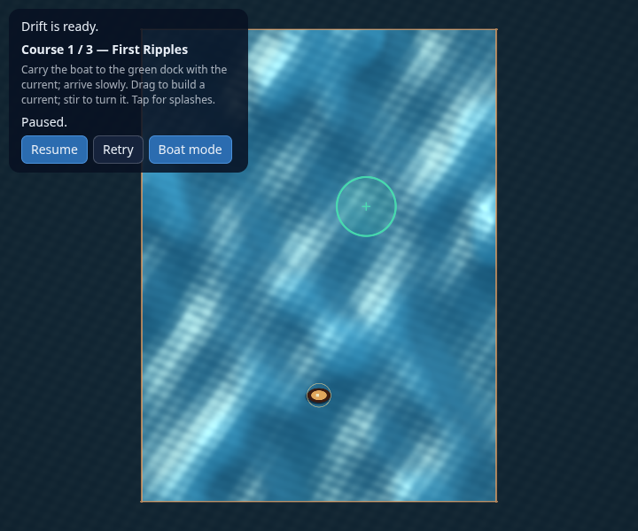
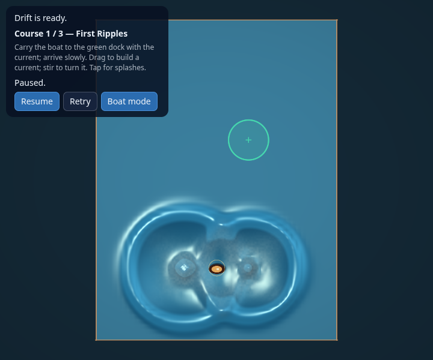

# Simulated ocean surface

The ocean and boat share a 48 × 64 staggered velocity/free-surface grid. Swiping
adds directional momentum along the actual pointer path; circular motion adds
circulation without recognizing a shape. Tapping applies pressure over a finite
6 m footprint and 0.28-second sine-squared envelope. It does not create an
instant point displacement or an independent ring impulse on the boat.

Waves propagate, overlap, interfere and reflect from closed boundaries and
rasterized rocks. The default sea begins with eight standing gravity modes,
with frequencies derived from gravity, 4 m water depth and basin dimensions.
Continuous wind pressure sustains motion in the same solver. Existing waves
survive changes to sea strength; Retry seeds the selected sea state again.
`WaveIntensity` controls that strength. Wave scale/speed and bulk-current tuning
still control the small sub-grid shading detail; they do not retime the solver.




## Physics

At fixed 60 Hz, CFL-limited substeps solve the depth-averaged equations:

```
D u / Dt = -g gradient(eta) - gradient(p) - damping * u
partial eta / partial t = -divergence((H + eta) * u)
```

`g = 9.8 m/s²`, `H = 4 m`. Velocities use midpoint semi-Lagrangian advection.
Continuity uses shared upwind total-depth face fluxes, so neighboring cells
exchange the same volume. Height is neither clipped nor artificially damped.
A conservative timestep includes the 10 m/s component velocity bound and
`sqrt(g * maximumDepth)`; tests exercise positive depth in small basins.
Velocity damping and numerical diffusion dissipate energy. Rock and perimeter
faces close normal flow. Material displacement and foam advect with velocity;
compression and steep surface slopes generate foam, which gradually decays.

The formulation follows [Bridson's shallow-water lecture](https://www.cs.ubc.ca/~rbridson/courses/533d-fall-2005/nov17-cs533d-slides.pdf).
This is a depth-averaged shallow-water surface model with nonlinear continuity
and advected momentum. It does not resolve deep-water dispersion, overturning
breakers, air or airborne spray. Foam is a transported visual tracer, not a
separate multiphase fluid.

One bounded allocation holds the grid, scratch buffers, precomputed wind bases
and sixteen finite splash sources. Reset/stepping/input reuse it; no hot-path
allocations occur. Allocation failure is explicit through `Ready()`. Pointer
forcing integrates a compact 4 m brush with at most 0.4 m spacing, independent
of event density. Cancellation stops new forcing while existing waves evolve.
Pause, blur and terminal states freeze the simulation. Graphics restart keeps
its state. Ocean tuning mode advances the fluid while holding the boat still.

Boat drag samples the actual velocity, so a splash rocks the hull forward and
back as crests and troughs pass. Dragging builds a sustained steering current.
Legacy `Ripples` and front-contact counters remain for diagnostic compatibility;
they have no force or shader ring effect. Only crash feedback flashes the hull.

## Surface visualization

The renderer uploads every height/foam cell, rather than reducing the surface
to 16 × 24. A nine-tap positive quadratic B-spline reconstructs continuous height
and analytic surface gradients. Those gradients supply the normal used for
Fresnel sky reflection, sun/skylight highlights and diffuse water lighting;
depth controls absorption and height controls subtle crest coloration. This
makes the evolving wave geometry visible. Foam comes from the transported
solver state. Three weak gravity ripples add sub-grid normal detail, advected
by the material map. There are no scripted splash rings or V-shaped boat wakes.
Height-gradient normal construction follows the approach discussed in
[GPU Gems chapter 1](https://developer.nvidia.com/gpugems/gpugems/part-i-natural-effects/chapter-1-effective-water-simulation-physical-models).

The installed fullscreen RHI has no texture/compute API. The immutable uniform
snapshot therefore packs each full surface cell into one exact 24-bit integer
stored as `float32`: signed 16-bit height (zero 32768, range ±6 m) plus eight-bit
foam. Rendering clips heights beyond this range; simulation retains them.
A separate 16 × 24 transport snapshot carries velocity and material displacement
with eight-bit channels. Decode happens before interpolation.

The std140 block is 16128 bytes. Existing fields occupy bytes 0–735, boat motion
begins at 736, flow metadata at 752, coarse transport at 768, and full surface at
3840. C++ assertions, SPIR-V/WGSL/GLSL ES reflection and packaging enforce it.
The linked [engine PR](https://github.com/Alegruz/Ludus/pull/67) increases the
bounded uniform ceiling to the portable 16 KiB limit. The SDK revision is pinned
in `config/ludus-version.txt`; machine paths stay in ignored local presets.

## Verification

```bash
cmake --build --preset linux-clang-development
ctest --preset linux-clang-development --output-on-failure
cmake --build --preset web-emscripten-release
./scripts/package-web
python3 -m zipfile -e out/packages/drift-ocean-web-release.zip out/browser-qa/extracted
node tools/browser-tests/run.mjs out/browser-qa/extracted out/packages/drift-ocean-web-release.zip out/browser-qa/renderers
node tools/browser-tests/gestures.mjs out/browser-qa/extracted out/browser-qa/gestures
node tools/browser-tests/waves.mjs out/browser-qa/extracted out/browser-qa/waves
node tools/browser-tests/ripple.mjs out/browser-qa/extracted out/browser-qa/courses
```

Logic tests exercise finite forcing, wave persistence, constructive/destructive
interference and small-amplitude superposition, volume conservation, wind state,
solid boundaries, positive depth, clockwise/counterclockwise circulation,
material advection, boat response, input cancellation and campaign transitions.
Browser tests use actual mouse/emulated touch strokes, rendered screenshots,
exact pause freezing and graphics restart, plus the rescue campaign steered by
currents. Read-only diagnostics expose energy, height, curl and divergence.
Results and exact package identity are recorded in `OCEAN_WAVES_VALIDATION.json`.
The software-GPU campaign/gesture CI uses half render resolution while
retaining full simulation and pointer coordinates. Renderer and splash snapshots
run at full test resolution. SwiftShader verifies software rendering; physical mobile performance and the
hosted itch.io build remain separate acceptance work.
