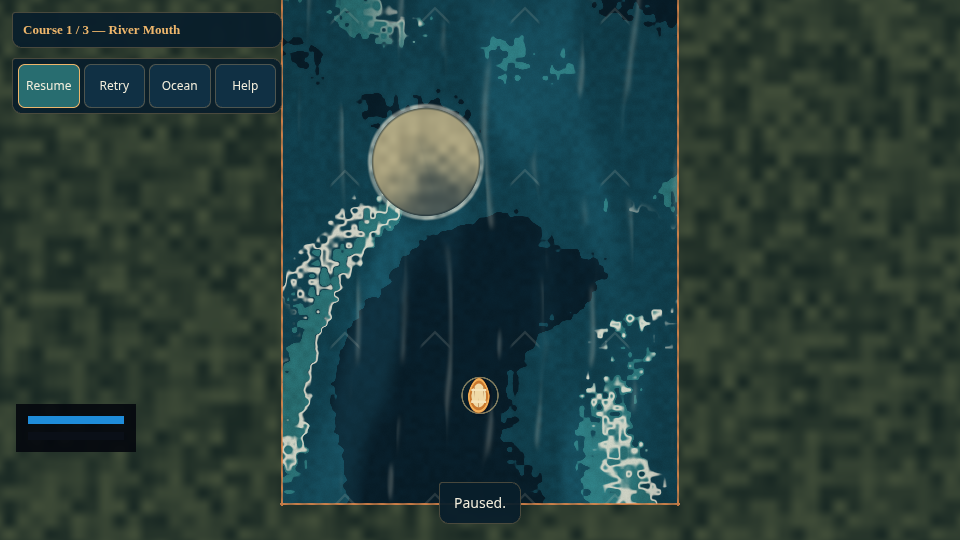
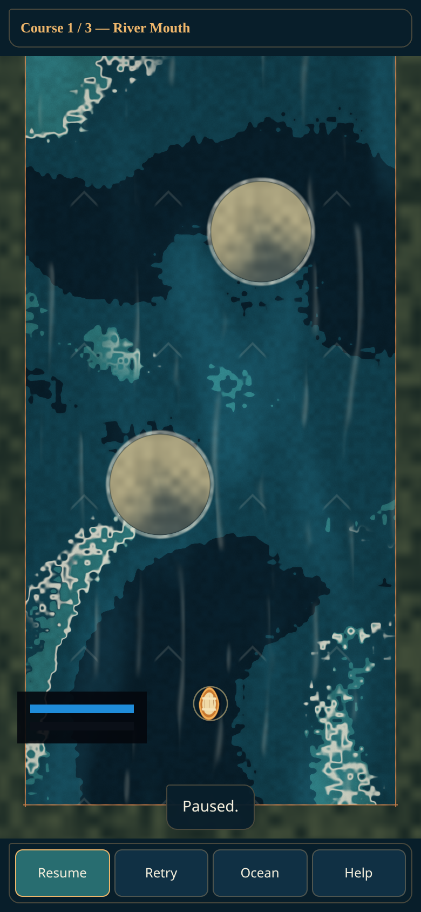

# Shared runtime HUD

Drift now consumes `Ludus::Ui` from the installed engine SDK. `GameHud` submits a
five-element value document: a panel, two tracks, and blue/green progress fills.
Blue indicates gesture readiness; green indicates dock dwell progress. The engine
resolves the same logical layout and clipped paint commands for Vulkan, WebGPU
and WebGL 2. The HUD is decoration, so it never captures gameplay gestures.

The browser's labeled status/progress and action controls remain real DOM
controls for keyboard, screen-reader and touch access. The canvas meters are
supplementary feedback. Native text and interactive menu controls need the
engine's later text/quad renderer; this change does not pretend to provide them.

The Help dialog explains both meter colors. Existing text feedback reports
docking and terminal state, so the player does not need color alone to progress.

The adapter uses the actual acquired framebuffer width divided by CSS width,
which handles both DPI scaling and RHI framebuffer clamping. Native uses scale 1
until the platform exports native logical scale. It anchors the panel at the
lower left, 88 logical pixels above the canvas bottom, with a 120-pixel maximum
width to keep the central boat lane and feedback clear. It clips to the viewport
and hides on logical surfaces below 180 pixels
in either direction. Future platform safe-area insets can be passed to the engine
viewport without modifying the layout algorithm.

The present RHI allows a single fullscreen triangle and a uniform block of at
most 16 KiB. The shader composites at most six ordered solid rectangles;
the CPU/Slang layout is explicitly mirrored at 16336 bytes, retaining the full
fluid surface snapshot. This is a bounded
adapter for a small HUD. Large menus should use the planned indexed-quad/scissor
renderer rather than increasing the fullscreen loop.

No engine source or private header is imported. CMake requires the `Ui` SDK
component, and `ludus_sandbox_ui_tests` verifies portrait clipping, DPI-equivalent
logical layout, command bounds and invalid/small viewport behavior. The pinned
engine revision includes Ui so native and browser CI build the same core.

See [the engine architecture](https://github.com/Alegruz/Ludus/blob/main/docs/architecture/ui.md)
for the reviewed Gems articles, ownership contracts and staged remaining work.

Local validation passed the native SDK build and all three CTests (including
5483 fluid/gameplay assertions), setup/tooling
regressions, formatting and static analysis of the new HUD/integration. Browser
Release ZIP pixels matched at desktop 1x and portrait 2x on both WebGPU and
WebGL 2. These screenshots use Chromium SwiftShader; physical devices and native
Vulkan pixels are unverified. CI validates the exact packaged Release payload.

